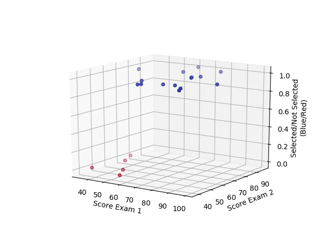

# Question 1
Suppose you are the CEO of a restaurant franchise and are considering
different cities for opening a new outlet. The chain already has outlets in
various cities and you have data for profits and populations from the cities.
You would like to use this data to help you select which city to expand to
next. The file ex1.txt contains data for the problem. The first column is
population of a city and second column is profit. Both values are in 10,000s.
A negative value of profit indicates a loss.
	a) Create a scatterplot between population and profits
	b) Develop an ML model to predict profit for a given city (by providing
	population)
# Question 2
Suppose you are selling your house and you want to see what a good market
price would be. The ex2.txt contains a training set of housing prices in India.
The first column is the size of the house (in square feet). The second column
is the number of bedrooms and the third column is the price of the house.
	a) Use scatter plots to visualize the data
	b) Develop an ML model to predict the house price using the scaled values.
# Question 3
Suppose that you are the administrator of a university department and you
want to determine applicants’ chance to get admitted to a course.
Admission is based on the scores of two exams. You have the historical data
of earlier students. The data contains the marks of two exams and their
admission status. Data is available in the file ex3.txt.
	a)Visualize the data using scatterplot (score1 in X axis , score2 in Y axis and
	two different colours for admitted and non admitted students)
	b)Develop an ML model to predict the admission status of a new set of
	students.
## q3.py

# Question 4
The sinking of the Titanic is one of the most infamous shipwrecks in history.
On April 15, 1912, during her maiden voyage, the Titanic sank after colliding
with an iceberg, killing 1502 out of 2224 passengers and crew. This
sensational tragedy shocked the international community and led to better
safety regulations for ships.
One of the reasons that the shipwreck led to such a loss of life was that there
were not enough lifeboats for the passengers and crew. Although there was
some element of luck involved in surviving the sinking, some groups of
people were more likely to survive than others, such as women, children, and
the upper-class.
Develop an ML model to predict the survival of passengers.
(Use titanic.csv file)
# Question 5
Predicting rock facies (classes of rocks) from well log data
Well log data is recorded either during drilling operations or after the drilling via
tools either on the drill string or wireline tools descended into the well.
Typically, geoscientists would take the logs and make correlations by hand. They
would have to draw lines from log to log to get a holistic view of the rock
type/facies, their characteristics, and their content. This can get tedious in
mature fields and is prone to likely misinterpretation in new fields.
Train a machine learning model that is able to predict the facies for wells not in
the training set.
Data set (mining.csv)
The data set we will use comes from University of Kansas. This dataset was taken
from nine wells with 3232 examples, consisting of a set of seven predictor
variables and a rock facies (class).
## Features:
	GR: gamma ray (GR)
	ILD_log10: resistivity logging (ILD_log10)PE: photoelectric effect (PE)
	DeltaPHI: neutron-density porosity difference
	PHIND: average neutron-density porosity
	NM_M: nonmarine-marine indicator
	RELPOS: relative position
## Rock facies:
	Nonmarine sandstone (SS)
	Nonmarine coarse siltstone (CSiS)
	Nonmarine fine siltstone (FSiS)
	Marine siltstone and shale (Sish)
	Mudstone (limestone) (MS)
	Wackestone (limestone) (WS)
	Dolomite (D)
	Packstone-grainstone (limestone) (PS)
	Phylloid-algal bafflestone (limestone) (BS)
